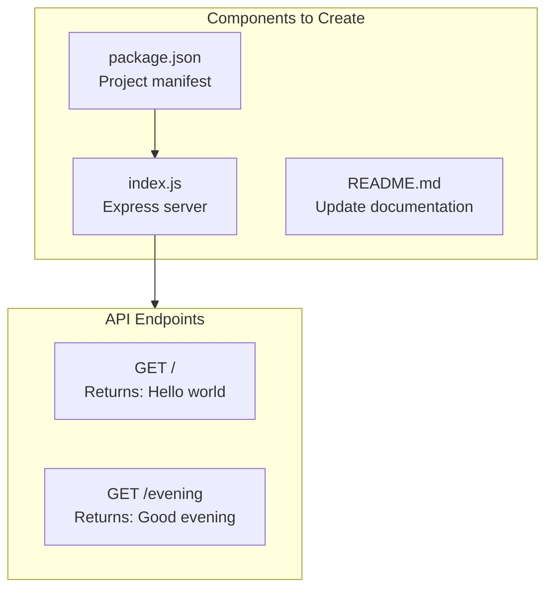
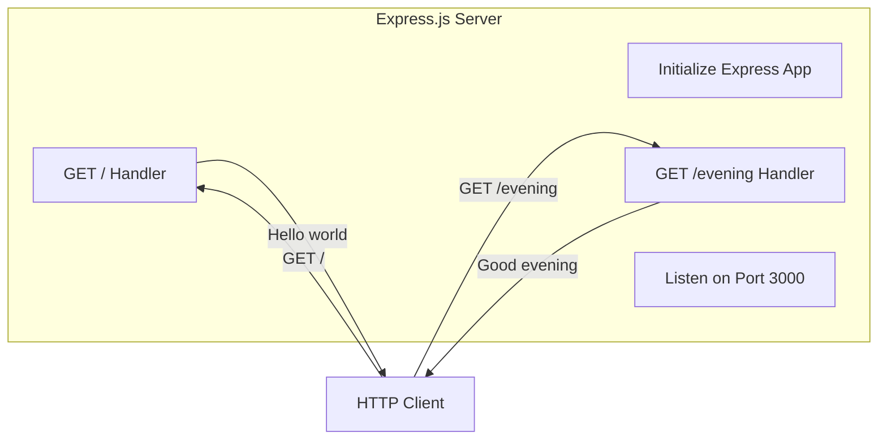
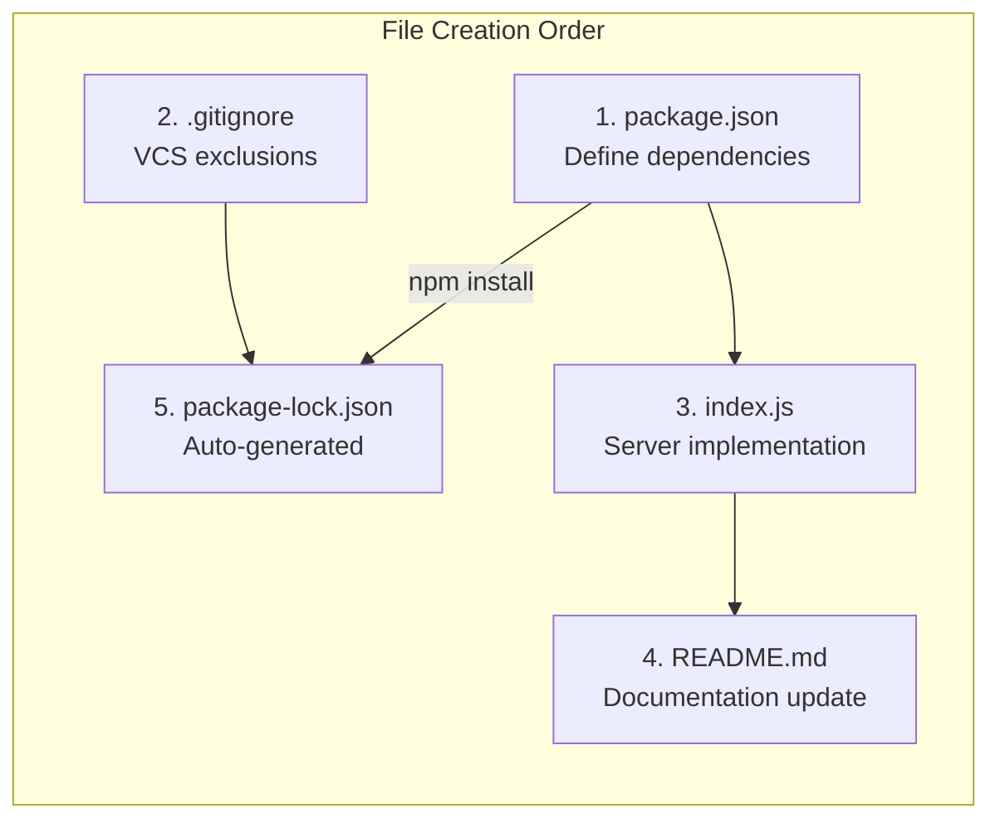
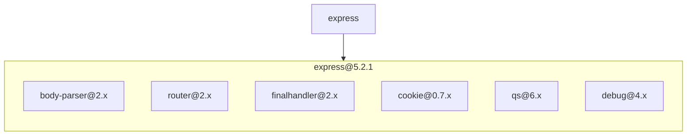

# Technical Specification

# 0. Agent Action Plan

## 0.1 Intent Clarification

Based on the user's input, the Blitzy platform understands this is a **Feature Addition Request**, not a security vulnerability fix. The request involves adding Express.js framework and creating new API endpoints.

### 0.1.1 Core Objective

**Primary Understanding:** Based on the requirements described, the Blitzy platform understands that the objective is to:

- **Add Express.js Framework:** Integrate Express.js into the project to enable robust HTTP server capabilities
- **Create Two API Endpoints:**
  - An endpoint that returns "Hello world" response
  - A new endpoint that returns "Good evening" response

**Requirement Category:** Feature Addition (New Framework Integration + New Endpoints)

**Complexity Level:** Low - Straightforward Express.js server setup with basic route handlers

### 0.1.2 Technical Interpretation

This feature addition request translates to the following technical implementation strategy:

| User Requirement | Technical Interpretation |
|-----------------|------------------------|
| "Add expressjs into the project" | Install Express.js v5.x as primary dependency, create package.json manifest |
| "One endpoint that returns Hello world" | Implement GET route handler at root path (`/`) returning plain text "Hello world" |
| "Add another endpoint that returns Good evening" | Implement additional GET route handler at designated path (`/evening`) returning plain text "Good evening" |
| "Tutorial of node js server" | Create minimal, educational server structure following Express.js best practices |

**Implementation Approach:**
- To achieve the Express.js integration, we will create a `package.json` with Express.js as the primary dependency
- To implement the "Hello world" endpoint, we will create a GET route at the root path (`/`)
- To implement the "Good evening" endpoint, we will create a GET route at `/evening` or similar path
- To maintain tutorial simplicity, we will use minimal configuration with clear code comments

### 0.1.3 Special Instructions and Constraints

**User-Specified Directives:**
- Scope preference: Feature addition to existing conceptual project
- Approach: Tutorial-oriented, educational codebase
- No security vulnerability remediation requested

**Implicit Requirements Identified:**
- Node.js runtime must be available
- Standard HTTP methods (GET) will be used
- Plain text responses expected
- Development-friendly configuration

**Change Scope:** Standard feature addition - creating new files to establish Express.js server

### 0.1.4 Current Repository State

**Critical Finding:** The repository currently contains only a placeholder README.md file with no existing Node.js code:

```
Repository Structure:
├── README.md (placeholder with title "12-dec-5")
└── .git/ (version control)
```

**Implication:** This is effectively a **greenfield implementation** - all Node.js server infrastructure must be created from scratch, including:
- `package.json` - Project manifest and dependencies
- `index.js` or `server.js` - Main server application file
- Updated `README.md` - Project documentation

## 0.2 Vulnerability Research and Analysis

**Note:** This request is for feature addition rather than security vulnerability remediation. However, security considerations are documented below for ensuring a secure implementation.

### 0.2.1 Initial Assessment

**Security Context Analysis:**
- CVE numbers mentioned: None
- Vulnerability names: None
- Affected packages: Not applicable (greenfield project)
- Symptoms described: None
- Security advisories referenced: None

**Request Classification:** Feature Addition - No security vulnerabilities to remediate

### 0.2.2 Proactive Security Research

While no vulnerabilities require remediation, research was conducted to ensure secure package selection:

**Express.js Security Status:**

| Aspect | Finding |
|--------|---------|
| Latest Stable Version | Express.js 5.2.1 (published December 2024) |
| Security Fixes Included | CVE-2024-45590 (ReDoS mitigation), CVE-2024-51999 (rejected/reverted) |
| Minimum Node.js Version | Node.js 18+ required for Express 5.x |
| Package Health | Actively maintained by OpenJS Foundation |

**Research Sources Consulted:**
- npm registry: Confirmed Express.js 5.2.1 as latest stable
- Express.js GitHub releases: Reviewed security changelog
- endoflife.date: Verified Node.js 20 LTS and Express support status

### 0.2.3 Security Posture Recommendations

For a secure greenfield implementation, the following security-conscious decisions are recommended:

| Decision | Recommendation | Rationale |
|----------|----------------|-----------|
| Express Version | Use Express.js ^5.2.1 | Latest stable with security patches |
| Node.js Version | Node.js 20 LTS | Long-term support with security updates |
| HTTP Headers | Consider helmet.js for production | Adds security headers automatically |
| Input Validation | Not required for static responses | Endpoints return fixed strings only |

### 0.2.4 Dependency Security Profile

**Express.js 5.x Security Improvements:**
- Updated `path-to-regexp` to v8.x with ReDoS mitigations
- Enhanced `body-parser` with improved depth limiting
- Removed deprecated API methods that could introduce vulnerabilities
- Promise rejection handling for middleware errors

**No Vulnerable Dependencies:** This is a new project - all selected dependencies will be current and patched versions.

## 0.3 Security Scope Analysis

### 0.3.1 Affected Component Discovery

**Repository Scan Results:**

| Search Pattern | Files Found | Status |
|----------------|-------------|--------|
| `*.js` | 0 | No JavaScript files exist |
| `package.json` | 0 | No package manifest exists |
| `*.ts` | 0 | No TypeScript files exist |
| `node_modules/` | 0 | No dependencies installed |
| `.env*` | 0 | No environment files |
| `Dockerfile*` | 0 | No container configuration |

**Discovery:** The repository is empty except for README.md placeholder. All required files must be created.

### 0.3.2 Component Creation Requirements

Since this is a greenfield implementation, the following components need to be **created** (not modified):



### 0.3.3 Current State Assessment

**Repository Inventory:**

| File | Status | Action Required |
|------|--------|-----------------|
| `README.md` | EXISTS (placeholder) | UPDATE with project documentation |
| `package.json` | MISSING | CREATE with Express.js dependency |
| `index.js` or `server.js` | MISSING | CREATE with Express server logic |
| `package-lock.json` | MISSING | GENERATED after npm install |
| `.gitignore` | MISSING | CREATE to exclude node_modules |

### 0.3.4 Scope of Implementation

**Direct Implementation Scope:**
- Server initialization and configuration
- Route handler definitions for both endpoints
- Package dependency management
- Basic project documentation

**Exposure Classification:**
- Application Type: Tutorial/Educational
- Intended Use: Local development
- Public Exposure: None specified
- Security Profile: Development-grade (no production hardening required)

### 0.3.5 No Existing Vulnerable Code

Since no code currently exists in the repository:
- No vulnerable code patterns to remediate
- No insecure configurations to fix
- No dependency vulnerabilities to patch
- All implementation will follow current security best practices

## 0.4 Version Compatibility Research

### 0.4.1 Express.js Version Selection

**Research Findings:**

| Version | Release Date | Status | Security |
|---------|--------------|--------|----------|
| Express 5.2.1 | December 2024 | Latest Stable | All current patches |
| Express 5.0.0 | October 15, 2024 | Major Release | Initial v5 release |
| Express 4.21.2 | 2024 | LTS | Security patches applied |

**Recommended Version:** Express.js `^5.2.1`

**Rationale:**
- Latest stable release with security improvements
- Includes ReDoS mitigation via updated `path-to-regexp@8.x`
- Addresses CVE-2024-45590
- Better promise support for middleware error handling
- Actively maintained by OpenJS Foundation

### 0.4.2 Node.js Compatibility

**Express 5.x Requirements:**

| Requirement | Specification |
|-------------|---------------|
| Minimum Node.js | 18.x |
| Recommended Node.js | 20 LTS or 22 LTS |
| npm Version | 9.x or higher |

**Compatibility Matrix:**

| Node.js Version | Express 5.x Support | Recommendation |
|-----------------|---------------------|----------------|
| Node.js 22.x | ✅ Full Support | Production ready |
| Node.js 20.x LTS | ✅ Full Support | **Recommended** |
| Node.js 18.x LTS | ✅ Full Support | Minimum supported |
| Node.js 16.x | ❌ Not Supported | Do not use |

### 0.4.3 Package Dependencies

**Required Dependencies:**

| Package | Version | Purpose |
|---------|---------|---------|
| `express` | ^5.2.1 | Web framework |

**Development Dependencies (Optional for tutorial):**

| Package | Version | Purpose |
|---------|---------|---------|
| `nodemon` | ^3.x | Development auto-restart (optional) |

### 0.4.4 Breaking Changes Considerations

**Express 5.x Migration Notes (for reference):**
- `res.redirect('back')` no longer supported - use `req.get('Referrer') || '/'`
- Status codes must be integers between 100-999
- Middleware can now return rejected promises (caught by router)
- `body-parser` extended option defaults to `false`

**Impact on Implementation:** None - this is a new project, no migration required.

### 0.4.5 Environment Configuration

**Recommended Runtime Environment:**

```
Node.js: 20.x LTS
npm: 10.x
Express: 5.2.1
```

**package.json engines field recommendation:**

```json
"engines": {
  "node": ">=18.0.0"
}
```

## 0.5 Security Fix Design

**Note:** This section is adapted for feature implementation design since no security vulnerabilities require remediation.

### 0.5.1 Implementation Strategy

**Approach:** Minimal, secure Express.js server implementation following current best practices

**Strategy Type:** Greenfield Creation

| Component | Implementation Approach |
|-----------|------------------------|
| Project Manifest | Create `package.json` with Express.js ^5.2.1 |
| Server Application | Create `index.js` with minimal Express server |
| Route Handlers | Implement two GET endpoints with static responses |
| Documentation | Update README.md with setup instructions |

### 0.5.2 Server Implementation Design

**Express Server Architecture:**



**Route Handler Specifications:**

| Endpoint | Method | Path | Response Body | Status Code |
|----------|--------|------|---------------|-------------|
| Hello World | GET | `/` | "Hello world" | 200 |
| Good Evening | GET | `/evening` | "Good evening" | 200 |

### 0.5.3 Code Implementation Specification

**index.js Structure:**

```javascript
const express = require('express');
const app = express();
// Routes and listen configuration
```

**Route Handler Pattern:**

```javascript
app.get('/', (req, res) => {
  res.send('Hello world');
});
```

### 0.5.4 Security Best Practices Applied

Even for a tutorial project, the following security-conscious decisions are incorporated:

| Practice | Implementation |
|----------|----------------|
| Current Dependencies | Use latest stable Express.js ^5.2.1 |
| Minimal Attack Surface | Only expose required endpoints |
| No Sensitive Data | Static string responses only |
| Standard HTTP Methods | GET requests only |
| Default Security | Express.js built-in protections |

### 0.5.5 Project Structure Design

**Target Directory Structure:**

```
/
├── index.js          # Express server with route handlers
├── package.json      # Project manifest with dependencies
├── package-lock.json # Generated dependency lock file
├── .gitignore        # Exclude node_modules
└── README.md         # Updated project documentation
```

**File Responsibilities:**

| File | Primary Responsibility |
|------|----------------------|
| `index.js` | Server initialization, route definitions, port binding |
| `package.json` | Dependency declaration, scripts, project metadata |
| `.gitignore` | Version control exclusions |
| `README.md` | Setup instructions, usage documentation |

## 0.6 File Transformation Mapping

### 0.6.1 Complete File Transformation Table

**Transformation Modes:**
- **CREATE** - Create a new file that does not exist
- **UPDATE** - Modify an existing file
- **DELETE** - Remove an existing file
- **REFERENCE** - Use as a pattern/example

| Target File | Transformation | Source/Reference | Implementation Details |
|-------------|----------------|------------------|------------------------|
| `package.json` | CREATE | Express.js project template | Project manifest with Express.js ^5.2.1 dependency, npm scripts |
| `index.js` | CREATE | Express.js server template | Main server file with Express app, two GET route handlers, port configuration |
| `README.md` | UPDATE | `README.md` | Update placeholder with project documentation, setup instructions, API endpoints |
| `.gitignore` | CREATE | Node.js gitignore template | Exclude node_modules/, .env files, IDE configurations |
| `package-lock.json` | CREATE | Auto-generated by npm | Dependency lock file (generated during `npm install`) |

### 0.6.2 File Creation Specifications

## package.json

**Purpose:** Project manifest defining metadata and dependencies

**Content Specification:**
```json
{
  "name": "express-tutorial",
  "version": "1.0.0",
  "main": "index.js"
}
```

**Required Fields:**
- `name`: Project identifier
- `version`: Semantic version
- `description`: Project purpose
- `main`: Entry point (`index.js`)
- `scripts.start`: `node index.js`
- `dependencies.express`: `^5.2.1`
- `engines.node`: `>=18.0.0`

---

## index.js

**Purpose:** Express server application with route handlers

**Implementation Requirements:**

| Requirement | Specification |
|-------------|---------------|
| Import Express | `const express = require('express');` |
| Create App | `const app = express();` |
| Define Port | `const PORT = process.env.PORT \|\| 3000;` |
| Route 1 | GET `/` returns "Hello world" |
| Route 2 | GET `/evening` returns "Good evening" |
| Start Server | `app.listen(PORT, callback)` |

**Code Structure:**
```javascript
// Import, configure, routes, listen
```

---

## .gitignore

**Purpose:** Exclude unnecessary files from version control

**Patterns to Include:**
```
node_modules/
.env
.env.local
*.log
.DS_Store
```

---

## README.md (Update)

**Purpose:** Document project setup and usage

**Sections Required:**
- Project title and description
- Prerequisites (Node.js 18+)
- Installation instructions
- Running the server
- API endpoint documentation
- Example responses

### 0.6.3 Line-by-Line Change Specifications

## README.md Updates

| Section | Current State | After Update |
|---------|---------------|--------------|
| Title | "# 12-dec-5" | "# Express.js Tutorial Server" |
| Description | None | Project overview and purpose |
| Installation | None | npm install instructions |
| Usage | None | npm start command |
| Endpoints | None | API documentation table |

### 0.6.4 File Dependency Graph



### 0.6.5 Comprehensive File Checklist

| # | File Path | Action | Priority | Dependencies |
|---|-----------|--------|----------|--------------|
| 1 | `package.json` | CREATE | Critical | None |
| 2 | `.gitignore` | CREATE | High | None |
| 3 | `index.js` | CREATE | Critical | package.json |
| 4 | `README.md` | UPDATE | Medium | index.js (for endpoint docs) |
| 5 | `package-lock.json` | CREATE (auto) | N/A | npm install |

**Total Files:** 5 (4 manual + 1 auto-generated)

## 0.7 Dependency Inventory

### 0.7.1 Production Dependencies

| Registry | Package Name | Version | Purpose | Security Status |
|----------|--------------|---------|---------|-----------------|
| npm | express | ^5.2.1 | Web framework for HTTP server and routing | ✅ Latest with security patches |

### 0.7.2 Development Dependencies (Optional)

For enhanced development experience, the following optional dependencies may be included:

| Registry | Package Name | Version | Purpose | Required |
|----------|--------------|---------|---------|----------|
| npm | nodemon | ^3.1.0 | Auto-restart on file changes | Optional |

### 0.7.3 Dependency Chain Analysis

**Express.js Transitive Dependencies (v5.2.1):**



**Key Transitive Dependencies:**

| Package | Version | Purpose |
|---------|---------|---------|
| body-parser | ^2.2.x | Request body parsing |
| router | ^2.2.x | HTTP routing engine |
| finalhandler | ^2.1.x | Final response handler |
| cookie | ^0.7.x | Cookie parsing |
| qs | ^6.14.x | Query string parsing |
| debug | ^4.4.x | Debug logging utility |

### 0.7.4 Import Configuration

**Required Import Statement (index.js):**

```javascript
const express = require('express');
```

**No Import Transformations Required:**
- This is a new project
- No existing imports to update
- No package replacements needed

### 0.7.5 Package Registry Configuration

**npm Registry:** Default public registry (https://registry.npmjs.org/)

**Package Installation Command:**
```bash
npm install express@^5.2.1
```

**With Optional Development Dependency:**
```bash
npm install express@^5.2.1
npm install --save-dev nodemon@^3.1.0
```

### 0.7.6 Lock File Strategy

**package-lock.json:**
- Will be automatically generated during `npm install`
- Ensures reproducible builds
- Locks exact versions of all transitive dependencies
- Should be committed to version control

### 0.7.7 Dependency Security Verification

**Post-Installation Security Check:**
```bash
npm audit
```

**Expected Result:** 0 vulnerabilities found (using latest Express.js)

### 0.7.8 Environment Variable Dependencies

**Runtime Configuration:**

| Variable | Default | Purpose |
|----------|---------|---------|
| PORT | 3000 | HTTP server port |

**No External Service Dependencies:**
- No database connections
- No API keys required
- No authentication services
- No cloud service integrations

## 0.8 Impact Analysis and Testing Strategy

### 0.8.1 Implementation Impact Assessment

**Impact Classification:** Low Risk - Greenfield Implementation

| Impact Area | Assessment |
|-------------|------------|
| Existing Code | No impact (no existing code) |
| External Services | No impact (no integrations) |
| Users | No impact (new feature) |
| Build Pipeline | Requires `npm install` step |
| Documentation | README.md update required |

### 0.8.2 Functional Testing Requirements

**Endpoint Verification Tests:**

| Test Case | Endpoint | Method | Expected Response | Expected Status |
|-----------|----------|--------|-------------------|-----------------|
| TC-001 | `/` | GET | "Hello world" | 200 OK |
| TC-002 | `/evening` | GET | "Good evening" | 200 OK |
| TC-003 | `/nonexistent` | GET | 404 response | 404 Not Found |

### 0.8.3 Manual Testing Procedures

**Server Startup Verification:**
```bash
npm start
```
**Expected Output:** Server listening message on port 3000

**Endpoint Testing with curl:**

| Test | Command | Expected Result |
|------|---------|-----------------|
| Hello World | `curl http://localhost:3000/` | "Hello world" |
| Good Evening | `curl http://localhost:3000/evening` | "Good evening" |

### 0.8.4 Verification Commands

**Installation Verification:**
```bash
npm install
```
**Expected:** Dependencies installed successfully, package-lock.json created

**Server Start Verification:**
```bash
npm start
```
**Expected:** Server running on port 3000

**Dependency Audit:**
```bash
npm audit
```
**Expected:** 0 vulnerabilities

### 0.8.5 Testing Checklist

| # | Test Category | Test Description | Pass Criteria |
|---|---------------|------------------|---------------|
| 1 | Installation | npm install completes | No errors, node_modules created |
| 2 | Startup | npm start runs server | "Server running" message displayed |
| 3 | Endpoint 1 | GET / returns correct response | Response body equals "Hello world" |
| 4 | Endpoint 2 | GET /evening returns correct response | Response body equals "Good evening" |
| 5 | Security | npm audit passes | 0 vulnerabilities reported |
| 6 | Error Handling | Invalid route returns 404 | 404 status code returned |

### 0.8.6 Automated Testing (Optional)

For production-ready implementations, consider adding:

| Test Type | Tool | Files |
|-----------|------|-------|
| Unit Tests | Jest | `tests/server.test.js` |
| Integration Tests | Supertest | `tests/endpoints.test.js` |
| API Tests | Postman/Newman | `tests/postman-collection.json` |

**Note:** Formal test suite is optional for this tutorial-focused implementation.

### 0.8.7 Rollback Plan

**Rollback Strategy:** Since this is a greenfield implementation:

| Scenario | Action |
|----------|--------|
| Installation Fails | Remove `node_modules/` and `package-lock.json`, retry |
| Server Fails to Start | Check Node.js version (requires 18+), verify `index.js` syntax |
| Complete Rollback | Delete created files, restore original `README.md` |

### 0.8.8 Performance Baseline

**Expected Response Times (Development Environment):**

| Endpoint | Expected Latency |
|----------|------------------|
| GET `/` | < 10ms |
| GET `/evening` | < 10ms |

**Resource Usage:**
- Memory: ~30-50MB (Node.js baseline)
- CPU: Minimal (static responses)

## 0.9 Scope Boundaries

### 0.9.1 Exhaustively In Scope

**Core Implementation Files:**

| File Pattern | Purpose | Action |
|--------------|---------|--------|
| `package.json` | Project manifest with Express.js dependency | CREATE |
| `index.js` | Express server with route handlers | CREATE |
| `README.md` | Project documentation | UPDATE |
| `.gitignore` | Version control exclusions | CREATE |
| `package-lock.json` | Dependency lock file | CREATE (auto) |

**Functional Scope:**

| Feature | Description | Endpoint |
|---------|-------------|----------|
| Hello World Response | Returns "Hello world" text | GET `/` |
| Good Evening Response | Returns "Good evening" text | GET `/evening` |
| Server Startup | Express server initialization | N/A |

**Technical Scope:**

| Component | Specification |
|-----------|---------------|
| Framework | Express.js ^5.2.1 |
| Runtime | Node.js 18+ |
| HTTP Methods | GET only |
| Response Format | Plain text |
| Port | 3000 (default) or PORT env variable |

### 0.9.2 Explicitly Out of Scope

**Features NOT Included:**

| Excluded Feature | Rationale |
|------------------|-----------|
| Database integration | Not requested, tutorial focus |
| Authentication/Authorization | Not requested |
| POST/PUT/DELETE endpoints | Only GET endpoints requested |
| Production deployment configuration | Tutorial-grade implementation |
| Docker containerization | Not requested |
| CI/CD pipeline | Not requested |
| Unit test suite | Optional for tutorial |
| TypeScript support | JavaScript only |
| Environment variables file | PORT is only optional config |
| Logging middleware | Not requested |
| Error handling middleware | Default Express behavior |
| API versioning | Simple tutorial API |
| CORS configuration | Not requested |
| Rate limiting | Not requested |
| Input validation | No user input to validate |

**Infrastructure NOT Included:**

| Excluded Infrastructure | Rationale |
|------------------------|-----------|
| Dockerfile | Not requested |
| docker-compose.yml | Not requested |
| .github/workflows/*.yml | Not requested |
| kubernetes/*.yaml | Not requested |
| Terraform/CloudFormation | Not requested |

### 0.9.3 Boundary Constraints

**Change Scope Limitations:**

| Constraint | Specification |
|------------|---------------|
| Minimal Changes | Create only required files |
| No Refactoring | N/A (greenfield) |
| No Style Changes | N/A (greenfield) |
| Tutorial Focus | Simple, educational code |

### 0.9.4 File Coverage Summary

**Files to CREATE:** 4

| File | Required |
|------|----------|
| `package.json` | ✅ Critical |
| `index.js` | ✅ Critical |
| `.gitignore` | ✅ High |
| `package-lock.json` | ✅ Auto-generated |

**Files to UPDATE:** 1

| File | Required |
|------|----------|
| `README.md` | ✅ High |

**Files to DELETE:** 0

**Files to REFERENCE:** 0

### 0.9.5 Scope Validation Checklist

| Requirement | In Scope | Implemented By |
|-------------|----------|----------------|
| Add Express.js | ✅ Yes | package.json |
| Hello world endpoint | ✅ Yes | index.js GET / |
| Good evening endpoint | ✅ Yes | index.js GET /evening |
| Project setup docs | ✅ Yes | README.md |
| Authentication | ❌ No | Out of scope |
| Database | ❌ No | Out of scope |
| Testing | ❌ No | Out of scope |

## 0.10 Special Instructions

### 0.10.1 User-Specified Requirements

**Original User Request (Preserved):**
> "this is a tutorial of node js server hosting one endpoint that returns the response 'Hello world'. Could you add expressjs into the project and add another endpoint that return the reponse of 'Good evening'?"

**User-Specified Constraints:**

| Constraint | User Specification |
|------------|-------------------|
| Framework | Express.js specifically requested |
| Existing Endpoint | "Hello world" response |
| New Endpoint | "Good evening" response |
| Project Type | Tutorial (educational focus) |

### 0.10.2 Implementation Guidelines

**Code Style:**
- Tutorial-quality: Clear, well-commented code
- Educational approach: Simple patterns, no advanced features
- Readable: Self-documenting variable names

**Response Format:**
- Plain text responses (not JSON)
- Exact response strings as specified by user:
  - "Hello world" (not "Hello World" or "Hello, World!")
  - "Good evening" (exact case and spacing)

### 0.10.3 Execution Parameters

**Installation Commands:**
```bash
npm install
```

**Server Start Commands:**
```bash
npm start
```

**Verification Commands:**
```bash
curl http://localhost:3000/
curl http://localhost:3000/evening
```

### 0.10.4 Environment Requirements

**Minimum Runtime:**
```
Node.js: 18.x or higher
npm: 9.x or higher
```

**Verification:**
```bash
node --version
npm --version
```

### 0.10.5 Research References

**Web Research Conducted:**

| Source | Information Retrieved |
|--------|----------------------|
| npmjs.com/package/express | Latest version: 5.2.1 |
| expressjs.com/en/changelog | Security fix history |
| github.com/expressjs/express/releases | Release notes, CVE information |
| endoflife.date/express | Support status |
| endoflife.date/nodejs | Node.js LTS schedule |

### 0.10.6 Security Considerations

**For Production Deployment (Future):**

If this tutorial is later promoted to production, consider:

| Consideration | Recommendation |
|---------------|----------------|
| HTTPS | Enable TLS/SSL termination |
| Headers | Add helmet.js for security headers |
| Rate Limiting | Add express-rate-limit |
| Logging | Add morgan or winston |
| Environment | Use dotenv for configuration |

**Current Implementation:**
- Suitable for local development and learning
- Uses latest secure Express.js version
- No sensitive data exposed

### 0.10.7 Implementation Constraints

**Priority Order:**
1. Express.js integration (package.json)
2. Server initialization (index.js)
3. Route handlers (both endpoints)
4. Documentation (README.md)

**No Breaking Changes:**
- N/A - Greenfield implementation

**Backward Compatibility:**
- N/A - No existing functionality to maintain

### 0.10.8 Success Criteria

| Criterion | Measurement |
|-----------|-------------|
| Express.js Installed | package.json contains express dependency |
| Server Starts | `npm start` runs without errors |
| Hello World Works | GET `/` returns "Hello world" |
| Good Evening Works | GET `/evening` returns "Good evening" |
| Documentation Updated | README.md has setup instructions |
| No Vulnerabilities | `npm audit` reports 0 issues |

